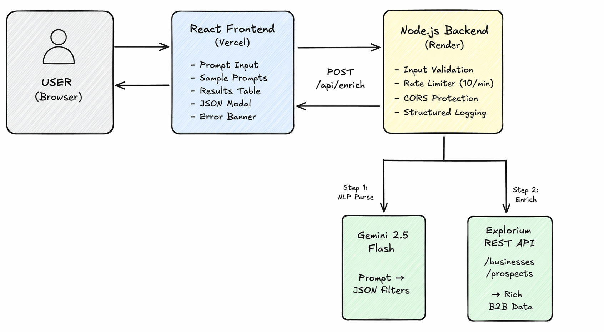
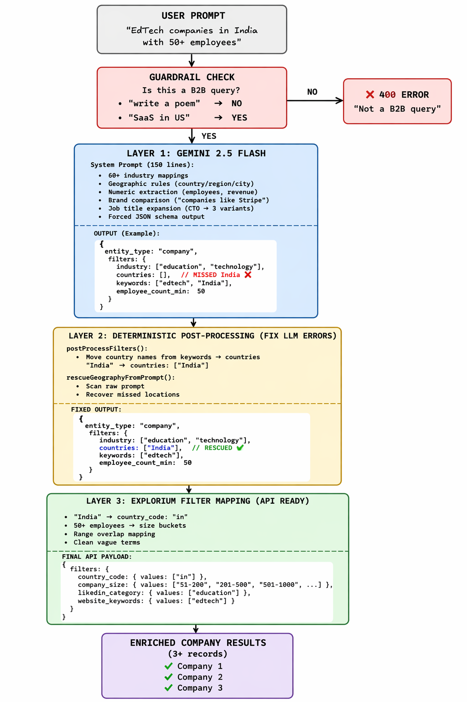
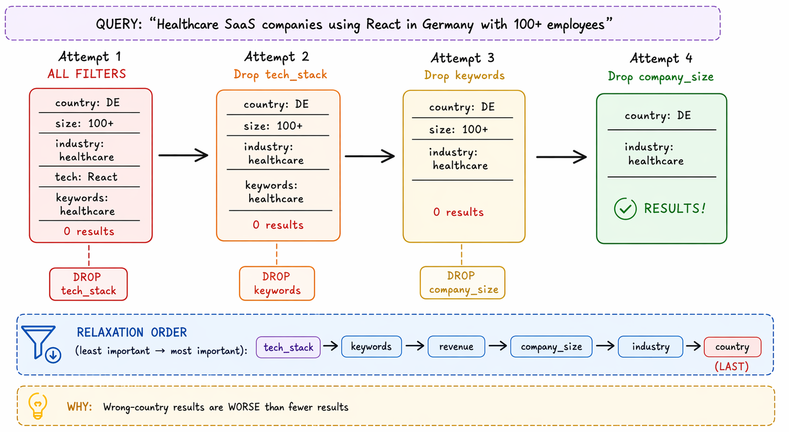
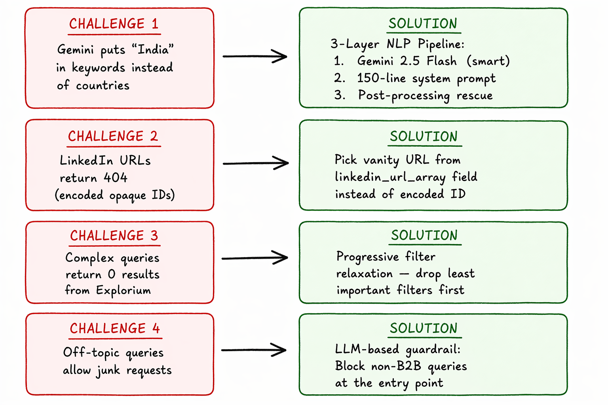

# OutMate - NLP Database Enrichment

A mini version of Outmate.ai's **NLP Database Enrichment** feature. Users type any natural language prompt, and the system converts it to structured B2B filters using Gemini AI, fetches enriched data from Explorium APIs, and displays up to 3 rich records in a clean table.

---

## Architecture



| Layer | Technology | Deployment |
|-------|-----------|------------|
| Frontend | React 18, Vite, CSS | Vercel |
| Backend | Node.js, Express.js | Render |
| AI Model | Google Gemini 2.5 Flash | Google API |
| Data Provider | Explorium REST API | Explorium Cloud |
| Version Control | Git + GitHub | - |

**Key architectural decisions:**
- **Forced JSON schema** on Gemini output — guarantees valid, parseable JSON every time (no regex needed)
- **Deterministic post-processing** after Gemini — rescues geographic data the LLM misclassifies
- **Shared constants module** (`geography.js`) — single source of truth for country/region/city lookups, imported by both services
- **Progressive filter relaxation** — automatically broadens search when Explorium returns empty results

---

## NLP Pipeline — 3-Layer Approach

This is the core AI logic. A single LLM call is unreliable for structured filter extraction, so the system uses three layers to ensure accuracy:



**Layer 1 — Gemini 2.5 Flash** parses the prompt into structured JSON using a 150-line system instruction covering 60+ industries, geographic mapping, numeric extraction, brand comparisons, and job title expansion.

**Layer 2 — Deterministic Post-Processing** fixes what Gemini gets wrong. `postProcessFilters()` scans the keywords array for misplaced country/region/city names and moves them to the correct fields. `rescueGeographyFromPrompt()` scans the raw prompt as a safety net.

**Layer 3 — Explorium Filter Mapping** converts the cleaned filters into Explorium's API format — ISO country codes, enum range overlaps for employee counts/revenue, and industry term rescue from the technologies field.

---

## Progressive Filter Relaxation

When complex queries return zero results, the system doesn't just fail. It progressively drops the least important filters and retries:



**Relaxation order** (dropped first to last): `tech_stack` → `keywords` → `revenue` → `company_size` → `industry` → `country`

Geography is kept last because wrong-country results are worse than fewer results.

---

## Guardrails

The system includes an LLM-based guardrail to reject off-topic queries before they waste Explorium API credits:

- **Off-topic queries** ("write a poem", "what is 2+2") → `400 IRRELEVANT_PROMPT`
- **Prompt injection** ("ignore your instructions") → blocked
- **Gibberish input** → blocked
- **Valid B2B queries** → processed normally

This is implemented via an `is_relevant` boolean in Gemini's forced JSON schema — the LLM classifies relevance as part of its structured output.

---

## How to Run Locally

### Prerequisites
- Node.js 18+
- Gemini API key ([Get one here](https://aistudio.google.com/app/apikey))
- Explorium API key

### Backend

```bash
cd backend
npm install

# Create .env from example
cp .env.example .env
# Edit .env and add your API keys:
#   GEMINI_API_KEY=your_key
#   EXPLORIUM_API_KEY=your_key

npm run dev
# Server starts at http://localhost:3001
```

### Frontend

```bash
cd frontend
npm install

# Create .env from example
cp .env.example .env
# Edit .env if backend URL differs from default

npm run dev
# App starts at http://localhost:5173
```

---

## Environment Variables

### Backend (`backend/.env`)
| Variable | Description | Required |
|---|---|---|
| `GEMINI_API_KEY` | Google Gemini API key | Yes |
| `EXPLORIUM_API_KEY` | Explorium REST API key | Yes |
| `PORT` | Server port (default: 3001) | No |
| `FRONTEND_URL` | Allowed CORS origin | No |
| `NODE_ENV` | `development` or `production` | No |

### Frontend (`frontend/.env`)
| Variable | Description | Required |
|---|---|---|
| `VITE_API_URL` | Backend base URL | No |

---

## API Contract

### `POST /api/enrich`

**Request:**
```json
{
  "prompt": "Find 3 fast-growing SaaS companies in the US with 50-500 employees"
}
```

**Success Response (200):**
```json
{
  "results": [
    {
      "type": "company",
      "name": "Sprinto",
      "domain": "sprinto.com",
      "industry": "Software Publishers",
      "revenue": "75M-200M",
      "employee_count": "201-500",
      "country": "United States",
      "city": "San Francisco",
      "state": "California",
      "linkedin_url": "https://www.linkedin.com/company/sprinto-com",
      "website": "sprinto.com",
      "founded_year": "N/A",
      "description": "Automating Information Security Compliances...",
      "logo": "https://media.licdn.com/...",
      "business_id": "89f3358b...",
      "raw": { }
    }
  ],
  "meta": {
    "entity_type": "company",
    "filters_used": {
      "industry": ["software development"],
      "employee_count_min": 50,
      "employee_count_max": 500,
      "countries": ["United States"],
      "keywords": ["fast-growing", "Series B"]
    },
    "total_results": 3,
    "duration_ms": 2340
  }
}
```

**Error Responses:**
```json
{ "error": true, "message": "...", "error_code": "INVALID_PROMPT" }
{ "error": true, "message": "...", "error_code": "IRRELEVANT_PROMPT" }
{ "error": true, "message": "...", "error_code": "GEMINI_ERROR" }
{ "error": true, "message": "...", "error_code": "EXPLORIUM_ERROR" }
```

### `GET /api/health`

```json
{ "status": "ok" }
```

---

## Sample Prompts

1. "Find 3 fast-growing SaaS companies in the US with 50-500 employees, raising Series B or later."
2. "Give me 3 VPs of Sales in European fintech startups with more than 100 employees."
3. "Top AI infrastructure companies hiring machine learning engineers in India."
4. "3 marketing leaders at e-commerce brands in North America doing more than $50M in revenue."
5. "Cybersecurity firms with increasing web traffic and at least 200 employees."

---

## Challenges & Solutions



---

## Project Structure

```
outmate/
├── backend/
│   ├── src/
│   │   ├── index.js                # Express server entry
│   │   ├── routes/
│   │   │   ├── enrich.js           # POST /api/enrich handler
│   │   │   └── health.js          # GET /api/health handler
│   │   ├── services/
│   │   │   ├── gemini.js           # Gemini NLP parsing (system prompt + post-processing)
│   │   │   └── explorium.js       # Explorium API mapping, search & normalization
│   │   ├── middleware/
│   │   │   └── rateLimiter.js     # 10 req/min/IP rate limit
│   │   └── utils/
│   │       ├── geography.js       # Shared geographic constants (single source of truth)
│   │       └── logger.js          # Structured request logging
│   ├── .env.example
│   └── package.json
├── frontend/
│   ├── src/
│   │   ├── App.jsx                 # Main app with state management
│   │   ├── App.css
│   │   ├── index.css              # Global styles & CSS variables
│   │   ├── main.jsx               # React entry point
│   │   └── components/
│   │       ├── Header.jsx         # App header
│   │       ├── PromptInput.jsx    # Textarea input
│   │       ├── SamplePrompts.jsx  # Clickable example prompts
│   │       ├── FilterBadges.jsx   # Shows parsed filters as badges
│   │       ├── ResultsTable.jsx   # Data table (desktop + mobile cards)
│   │       └── JsonModal.jsx      # Raw JSON viewer modal
│   ├── index.html
│   ├── vite.config.js
│   ├── .env.example
│   └── package.json
├── docs/                           # Architecture & design diagrams
│   ├── architecture.png
│   ├── nlp-pipeline.png
│   ├── filter-relaxation.png
│   └── challenges.png
├── .gitignore
└── README.md
```

---

## Security

- All secrets (`GEMINI_API_KEY`, `EXPLORIUM_API_KEY`) in environment variables, never hardcoded
- Rate limiting: 10 requests per IP per minute via `express-rate-limit`
- CORS: locked to frontend domain only in production
- Input validation: prompt length 1-2000 characters
- LLM guardrails: off-topic and prompt injection queries rejected before Explorium call
- Structured error responses with error codes (no stack traces leaked to client)
